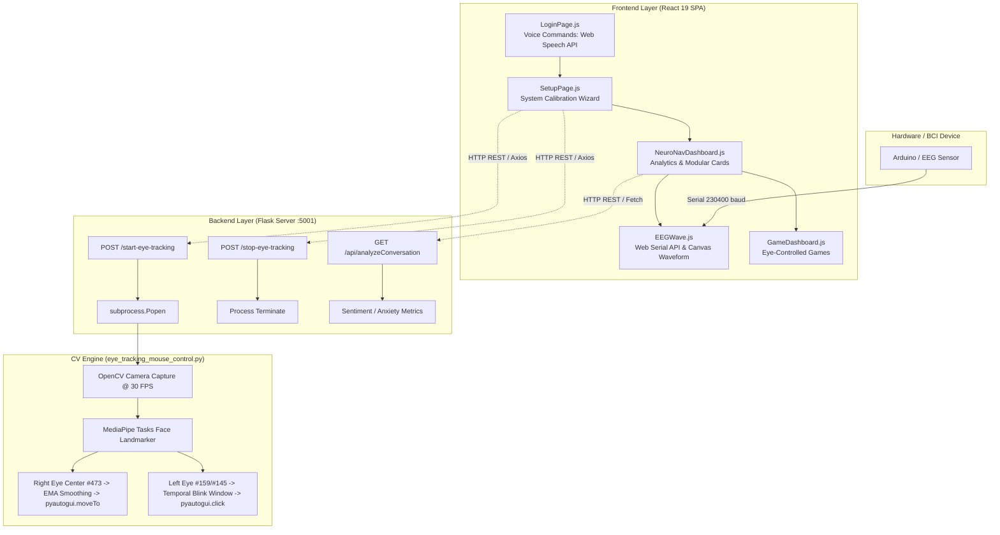

# NeuroNav — Gaze Eye Tracking & Neural Interface System
## Comprehensive Interview Preparation & Technical Architecture Guide

---

## 1. Executive Summary & Pitch Scripts

### ⏱️ 30-Second Elevator Pitch (For Introductions)
> *"**NeuroNav** is a multimodal assistive technology platform that enables hands-free computer navigation and neural wellness monitoring. It leverages real-time computer vision (MediaPipe Face Landmarker Tasks API) to map ocular gaze and distinct blink patterns into OS-level mouse movement and click actions. On the frontend, it provides a React 19 single-page dashboard featuring hands-free voice-activated control (Web Speech API), real-time Brain-Computer Interface (BCI) serial telemetry with custom Canvas rendering (230,400 baud), and BERT-based conversational sentiment analytics."*

### 🎙️ 2-Minute Deep Dive (When Asked *"Walk me through your project"*)
> *"I built a multimodal human-computer interface (HCI) and wellness dashboard called **NeuroNav**. The architecture consists of three key layers:*
> 1. ***Computer Vision & Hardware Control Engine (Python / OpenCV / MediaPipe / PyAutoGUI)***: *Tracks 478 3D facial mesh landmarks in real time (30 FPS, 720p). To solve the classic 'Midas Touch' problem in gaze tracking (where looking at an item accidentally triggers clicks), I decoupled cursor navigation (mapped to the right eye iris center landmark #473) from click actuation (measured via left eye upper/lower eyelid aperture #159 & #145). It uses dynamic min-max calibration, exponential smoothing (EMA), and temporal duration windowing (50ms–500ms) to filter out involuntary blinks.*
> 2. ***Backend Orchestrator (Flask / Subprocess API)***: *Provides RESTful lifecycle management over the computer vision background process via `subprocess.Popen` with fail-fast health checks and serves conversational sentiment data.*
> 3. ***Interactive Neural Frontend (React 19 / Recharts / Web Serial API / Web Speech API)***: *Features hands-free voice login, a step-by-step hardware calibration wizard, direct browser-to-microcontroller serial communication (`navigator.serial` at 230,400 baud) for live EEG telemetry, dynamic canvas rendering, and NLP sentiment tracking."*

---

## 2. Project Directory Structure

```
gaze eye tracking/
├── README.md                                 # Project startup and manual run instructions
├── start.sh                                  # Process orchestration script (Flask + React)
├── generate_pdf.py                           # Automated ReportLab PDF generator
├── NeuroNav_Interview_Preparation_Guide.pdf  # Generated executive PDF handbook
├── INTERVIEW_PREPARATION_GUIDE.md            # Markdown interview handbook
│
├── backend/                                  # Python Backend & Computer Vision Core
│   ├── flask_server.py                       # REST API (Process lifecycle & sentiment endpoints)
│   ├── eye_tracking_mouse_control.py         # MediaPipe gaze tracking, calibration & PyAutoGUI controller
│   ├── face_landmarker.task                  # Pre-trained MediaPipe Tasks vision model asset (478 3D landmarks)
│   ├── backend.log                           # Server execution logs
│   ├── debug_eye*.log                        # Computer vision debug outputs
│   └── conversation_log.txt                  # Chat logs for sentiment extraction
│
└── frontend/                                 # React 19 Frontend Web Application
    ├── package.json                          # Dependencies (Axios, Framer Motion, Recharts, Lucide, Web Speech)
    ├── public/                               # Static HTML template & assets
    └── src/
        ├── App.js                            # Central React Router configuration
        ├── App.css / index.css               # Base styling & resets
        └── components/
            ├── LoginPage.js                  # Hands-free login with Web Speech API voice triggers
            ├── SetupPage.js                  # Hardware initialization & calibration wizard
            ├── NeuroNavDashboard.js          # Central dashboard with Recharts time-series analytics
            ├── EEGWave.js                    # Web Serial API BCI connector, Canvas waveform & blink triggers
            ├── GameDashboard.js              # Eye-movement gaming portal
            ├── GameDashboard.css             # Styling for game dashboard
            ├── Sentimentanalysis.py          # Standalone BERT (Hugging Face) NLP sentiment/stress engine
            └── NeuroCss.css                  # Glassmorphism, animations & dark cyber-neural design system
```

---

## 3. Architecture & Data Flow



---

## 4. Deep Dive into Core Modules

### 👁️ Module 1: Computer Vision & Gaze Tracking Engine (`eye_tracking_mouse_control.py`)
- **Model**: MediaPipe Tasks Face Landmarker (`face_landmarker.task`) predicting 478 3D landmarks.
- **De-coupled Asymmetric Tracking**:
  - **Right Eye (`Landmark 473`)**: Controls cursor movement.
  - **Left Eye (`Landmark 159` - Top, `Landmark 145` - Bottom)**: Controls blink/click actions.
- **Dynamic Calibration & Coordinate Mapping**:
  - Captures 200 initial baseline frames to compute $[x_{\min}, x_{\max}, y_{\min}, y_{\max}]$ with a $5\%$ dynamic margin.
  - Normalizes input coordinates to $[0, 1]$ and maps them to screen resolution via `np.interp`.
  - Applies **Exponential Moving Average (EMA)** smoothing:
    $$\text{screen\_x} = 0.6 \cdot \text{prev\_x} + 0.4 \cdot \text{raw\_x}$$
- **Temporal Blink State Machine**:
  - Eyelid closure: $|y_{\text{top}} - y_{\text{bottom}}| < 0.01$.
  - Duration criteria: Valid click triggered only when $0.05\text{s} \le \text{duration} \le 0.5\text{s}$.
  - Cooldown: $0.7\text{s}$ debounce timer prevents accidental double-clicking.

---

### 🌐 Module 2: Process Orchestration & REST API (`flask_server.py`)
- Spawns and manages `eye_tracking_mouse_control.py` as an asynchronous background subprocess (`subprocess.Popen`).
- **Fail-Fast Verification**: Polling interval of $0.8\text{s}$ inspects `process.poll()` and captures `stderr` to handle camera permission errors or missing drivers gracefully.
- Endpoints:
  - `POST /start-eye-tracking`: Initiates gaze tracking.
  - `POST /stop-eye-tracking`: Terminates active PID.
  - `GET /api/analyzeConversation`: Calculates historical sentiment, anxiety, depression, and stress trends.

---

### 💻 Module 3: Frontend Architecture (`LoginPage.js`, `SetupPage.js`, `NeuroNavDashboard.js`)
- **Voice Control ([`LoginPage.js`](file:///Users/rahulnegi/Desktop/gaze%20eye%20tracking/frontend/src/components/LoginPage.js))**:
  - Uses `react-speech-recognition` to listen for continuous wake words (`"hello"`, `"hey"`, `"listen"`), action triggers (`"login"`), and deactivation (`"bye"`).
- **Setup Flow ([`SetupPage.js`](file:///Users/rahulnegi/Desktop/gaze%20eye%20tracking/frontend/src/components/SetupPage.js))**:
  - 3-step interactive onboarding state machine communicating with Flask backend via Axios.
- **Dashboard ([`NeuroNavDashboard.js`](file:///Users/rahulnegi/Desktop/gaze%20eye%20tracking/frontend/src/components/NeuroNavDashboard.js))**:
  - Time-series visualization with `Recharts` and diagnostic metric cards.

---

### 🧠 Module 4: Brain-Computer Interface & Serial Streaming (`EEGWave.js`)
- **Web Serial API**: Direct browser connection to Arduino/BCI hardware via `navigator.serial.requestPort()` at **230,400 baud**.
- **Real-Time Canvas**: Decodes streaming buffer and plots EEG waveform on an HTML5 2D `<canvas>` without triggering React DOM re-renders.
- **Hardware Gesture Macros**:
  - Counts bioelectric voltage spikes ($> 700\mu\text{V}$) in a 3-second sliding window:
    - **2 Blinks**: Toggles interactive CSS brightness slider (`document.body.style.filter`).
    - **4 Blinks**: Focus Mode ($100\%$ screen brightness + focused audio).
    - **8 Blinks**: Relaxation Mode ($30\%$ screen brightness + soothing audio).

---

### 📊 Module 5: NLP Sentiment & Mental Health Engine (`Sentimentanalysis.py`)
- Uses pre-trained Hugging Face Transformers (`bert-base-uncased`) with `BertForSequenceClassification`.
- Generates 5-class sentiment probability distributions ($0-100$) and estimates anxiety, depression, and stress indices.

---

## 5. Key Engineering Challenges & Solutions

| Challenge | Root Cause / Difficulty | Architectural Solution |
| :--- | :--- | :--- |
| **Gaze Jitter vs. Input Lag** | Human eyes produce involuntary micro-saccades; heavy filtering adds lag. | Calibrated min-max coordinate clamping with a tuned $0.6$ Exponential Moving Average (EMA). |
| **The "Midas Touch" Problem** | Looking at elements triggers false clicks whenever the user blinks naturally. | **Asymmetric eye roles**: Right eye coordinates position, Left eye triggers clicks with a $50\text{ms}-500\text{ms}$ temporal window and $700\text{ms}$ cooldown. |
| **Cross-Process Synchronization** | Managing long-running Python vision loops from a web GUI without locking server threads. | Managed background subprocesses via `subprocess.Popen` with explicit PID tracking and POSIX signal traps. |
| **High-Frequency Serial Data in React** | 230.4k baud serial streaming causes React component state updates to bottleneck the UI. | Decoupled telemetry state from React virtual DOM by streaming chunks to a ref buffer and rendering on an HTML5 2D Canvas. |

---

## 6. Top 10 Technical Interview Questions & Answers

### Q1: Why did you choose MediaPipe Face Landmarker over dlib or OpenCV Haar Cascades?
> **Answer**: *"MediaPipe Face Landmarker predicts 478 3D landmarks (including dedicated sub-pixel iris points like #473) using lightweight, hardware-accelerated deep neural networks capable of 30+ FPS on standard CPU hardware. Haar cascades only detect 2D bounding boxes without landmark depth, and dlib's 68-point model is computationally heavier and lacks fine-grained iris landmarks."*

### Q2: How does your coordinate mapping algorithm translate eye movements to screen pixels?
> **Answer**: *"During calibration, the system records 200 frames of eye movement to establish $[x_{\min}, x_{\max}, y_{\min}, y_{\max}]$. During runtime, normalized coordinates $\frac{x - x_{\min}}{x_{\max} - x_{\min}}$ are scaled via linear interpolation (`np.interp`) to screen dimensions and smoothed using an Exponential Moving Average: $S_t = 0.6 \cdot S_{t-1} + 0.4 \cdot Y_t$."*

### Q3: How did you solve the Midas Touch problem in gaze tracking?
> **Answer**: *"I separated ocular responsibilities: the right eye coordinates navigation, while the left eye vertical aperture handles clicks. Blinks are validated against a strict temporal window (50ms to 500ms) with a 700ms debounce cooldown."*

### Q4: Why use the Web Serial API instead of WebSockets for the BCI / Arduino module?
> **Answer**: *"The Web Serial API enables direct, zero-latency, driverless peer-to-peer communication between the browser and USB microcontrollers. It removes the need for users to run a local daemon/WebSocket relay, dramatically simplifying deployment."*

### Q5: How do you handle process termination and prevent zombie processes?
> **Answer**: *"Flask maintains a global reference to the spawned `subprocess.Popen` instance. The `/stop-eye-tracking` endpoint checks `poll()` and executes `terminate()`. Additionally, the root `start.sh` script registers a POSIX trap on `SIGINT`/`SIGTERM` to kill all child PIDs upon exit."*

### Q6: If the user tilts their head, how does your gaze tracking behave?
> **Answer**: *"Currently, coordinates are relative to the normalized frame landmark space. In our roadmap, we plan to implement 3D Pose Estimation: calculating the face's rotation vector via `solvePnP` using nose/chin landmarks and subtracting head pose angles from the eye vectors to make the system fully head-pose invariant."*

### Q7: Why did you use React 19 for the frontend?
> **Answer**: *"React provides component-driven isolation for managing asynchronous states (Web Speech API, Web Serial streams, REST polling, and dynamic SVG chart re-renders). Pairing it with Framer Motion ensures smooth 60 FPS transitions."*

### Q8: How does the voice command engine work in `LoginPage.js`?
> **Answer**: *"It uses the Web Speech API via `react-speech-recognition`. We configure continuous recognition with interim results and fuzzy command matching. The system listens for wake commands ('hello', 'listen'), sets an `activeListening` state, and executes target actions ('login', 'clear') with automatic transcript garbage collection."*

### Q9: How is conversational sentiment analyzed in this system?
> **Answer**: *"The architecture uses a PyTorch-based BERT sequence classification model (`bert-base-uncased`) to score conversational snippets. We calculate a weighted probability distribution across sentiment classes and derive secondary cognitive health metrics (anxiety, depression, and stress levels) plotted over time via Recharts."*

### Q10: What would you do differently if you were to redesign this system for production?
> **Answer**: 
> 1. *"Port the eye-tracking model entirely into the browser using **MediaPipe JavaScript / WebAssembly**, eliminating the need for a separate Python backend process."*
> 2. *"Replace the single-pole exponential moving average filter with a **1€ Filter (One Euro Filter)**, which dynamically adjusts smoothing based on movement velocity."*
> 3. *"Add user-specific profile calibration presets stored in a cloud database."*
